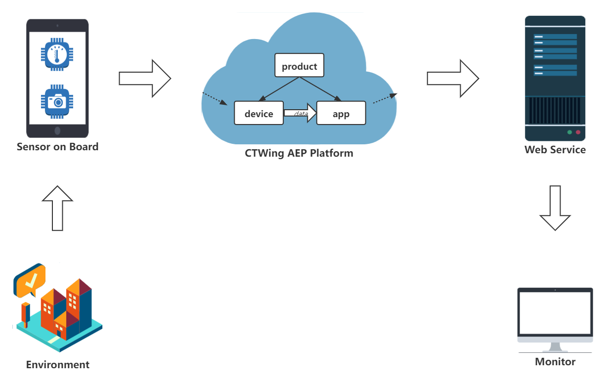

# IoT Portal Monitor

## Tools

- hardware: CTWingSKIT_BC28 Development Toolkit
- serial port driver: ST-LINK
- hardware development environment: Keli 5 MDK

- IoT platform: CTWing AEP
- platform access protocol: LWM2M


## Architecture




## Configuration

### 1. Hardware Development Toolkit

- Install ST-Link Driver: https://www.st.com/en/development-tools/stsw-link009.html
- Install Keli 5 MDK-ARM: https://www.keil.com/demo/eval/arm.htm

- Install package for STM32F103CB in Keli 5. Config the settings according to the tutorial.
- Download the sample program and import to the IDE. Config the address and port of the IoT platform.
- Compile and load to the board. The board will run the program automatically.

### 2. AEP Platform

- Apply for a rent account on [CTWing](https://www.ctwing.cn/) (real-name certification required).
- Open the IoT Enablement Service.
- Get the <u>product id, device id, master API key, app key, app secret</u>.
  - Create a product (**Choose “智慧农业→最佳实践→NB开发板”**)
  - Register the device (several seconds before activated)
  - Create an application.

- Download **Development SDK** on the page of application.

**hint: **the SDK includes all the API functions significant to the backend of web service.


## Workflow

- Make sure the development board is powered on and the program has been burned in.
- Issue the instructions of ‘set_auto_control’ and ‘set_report_period’. (Then board will upload data of sensors regularly)
- Start the web service to get data through API functions. The business functions are running based on it.


## AEP Platform Details

Do this each time when the sensor board is powered on.

- Website: https://www.ctwing.cn/
- Log in with username & password
- Enter the AEP console
- Issue instructions:
  - Device management → Product → Portal Monitor → Device management → Command issuance
  - issue: set_auto_control & set_report_period
- View data report and event report:
  - Device management → Product → Portal Monitor → Device management → Click on the device name
  - view the corresponding information bar (need to select the time period)


## Q&A

```bash
Error: L6050U: The code size of this image exceeds the maximum allowed for this version
```

- official solution: https://developer.arm.com/documentation/ka002709/latest

- piracy solution: 

  https://blog.csdn.net/qq_20250067/article/details/107619342

  https://www.jianshu.com/p/a9ff5abb9af7


## To learn more ...

[Link for Manuals](https://www.ctwing.cn/zdkftj/537)